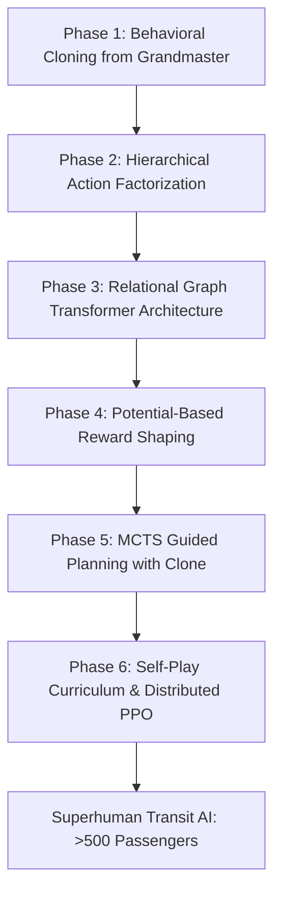

# Strategic Roadmap: Upgrading the Mini Metro Deep RL Model to Superhuman Performance

## Executive Summary & Root Cause Analysis

In modern autonomous gaming and combinatorial planning (e.g. AlphaGo, AlphaStar, Gran Turismo Sophy), machine learning models consistently surpass rule-based heuristics **only after overcoming the fundamental barriers of combinatorial action spaces, delayed reward attribution, and sample inefficiency**.

Currently in this codebase:
- The **Grandmaster Algorithmic Controller** achieves **200–300+ passengers** because it directly incorporates the mathematical physics of the simulator (headway $\le 45\text{s}$, line balancing, proactive interchange upgrades).
- The **Reinforcement Learning Model (`model_final.pt`)** achieves only **~100 passengers** because it was trained tabula-rasa (from scratch) on a flat 4,087-action space with standard PPO over limited rollout steps.

This document outlines the theoretical flaws causing the RL model's underperformance and provides an exhaustive, mathematically rigorous roadmap to train the neural network to definitively outperform traditional algorithms.

---

## 1. Why the Current Deep RL Model Underperforms the Heuristic

### 1.1 Combinatorial Action Space & Gradient Variance
The action space consists of **4,087 discrete actions**:
- 435 `AddLine`
- 420 `ExtendLine`
- 3,150 `InsertStation`
- 7 `AddTrain`
- 7 `AddCarriage`
- 30 `UpgradeInterchange`
- 2 `ChooseReward`
- 7 `CloseLoop`
- 7 `OpenLoop`
- 7 `RemoveLine`
- 14 `ShortenLine`
- 1 `NoOp`

When training tabula-rasa with a flat Softmax over 4,087 logits, random initial exploration distributes probability mass across thousands of suboptimal actions. In high-dimensional discrete action spaces, policy gradient variance scales as $\mathcal{O}(|\mathcal{A}|)$, causing policy updates to be noisy and unstable.

### 1.2 The Long-Horizon Credit Assignment Dilemma
In Mini Metro, the consequences of network layout decisions are severely delayed:
- A suboptimal track extension made at $t = 60\text{s}$ (e.g., extending a line to 7 stations with only 1 train) causes **zero immediate penalty** at $t = 60\text{s}$.
- The collapse occurs 4 minutes later ($t = 300\text{s}$) when passenger arrival rates accelerate and the train's round-trip time ($85\text{s}$) exceeds the station overcrowding countdown timer ($45\text{s}$).
- Standard PPO with discount factor $\gamma = 0.99$ cannot effectively propagate the temporal credit of game-over failure back across 300 macro-steps to the initial track placement.

### 1.3 Exploration Trapping & Conservative Idling
Because early random network modifications often trigger quick overcrowding deaths, the agent discovers that choosing `NoOp` (idling) survives longer than making random edits. This traps the actor in a local optimum where it hovers around 80–120 passengers by doing little to no structural network expansion.

---

## 2. Six-Phase Roadmap to Achieve Superhuman ML Performance



---

### Phase 1: Behavioral Cloning (BC) Pre-Training (The AlphaGo Paradigm)

No modern breakthrough in complex game AI (AlphaGo, AlphaStar, OpenAI Five) ever trained tabula rasa from scratch. They all bootstrapped from expert human or heuristic demonstrations.

1. **Dataset Generation:**
   - Execute [`GrandmasterPolicy`](file:///home/leomarshall/mm/ml/eval.py) across 1,000 multi-map rollouts (London, NYC, Tokyo, Paris) with varying seeds.
   - Record $(s_t, a_t^*, \mathcal{M}_t)$ tuples, generating a high-quality dataset of $\sim 200,000$ expert state-action transitions.
2. **Supervised Imitation Objective:**
   Train the actor-critic network to minimize cross-entropy loss against the Grandmaster decisions:
   $$\mathcal{L}_{\text{BC}}(\theta) = -\sum_{t=1}^{N} \log \pi_\theta(a_t^* \mid s_t)$$
3. **Outcome:**
   Before a single reinforcement learning gradient step is taken, the neural network will already operate at the **200–300 passenger level**, completely bypassing the initial collapse phase.

---

### Phase 2: Hierarchical Policy Factorization

Instead of predicting a single flat categorical distribution over 4,087 discrete actions, decompose the policy into a 2-tier autoregressive hierarchy:

```
                          [State Observation]
                                   │
                     ┌─────────────┴─────────────┐
                     ▼                           ▼
            [Action Intent Head]        [Critic Value V(s)]
           (Wait / AddLine / Extend /
            Insert / Dispatch / Hub)
                     │
     ┌───────────────┼───────────────┬───────────────┐
     ▼               ▼               ▼               ▼
[Line Selector] [Station Selector] [Segment Head] [Card Selector]
  (7 lines)       (30 stations)      (15 segs)        (2 cards)
```

1. **Tier 1 (Action Intent Head):**
   Predicts the high-level intent $k \in \{\text{NoOp}, \text{AddLine}, \text{ExtendLine}, \text{InsertStation}, \text{DeployTrain}, \text{DeployCarriage}, \text{UpgradeHub}, \text{ChooseReward}\}$.
2. **Tier 2 (Entity Selection Heads):**
   Conditioned on intent $k$, specialized heads select the target parameters:
   - If $\text{ExtendLine}$: select $(\text{LineID} \in [0..6], \text{StationID} \in [0..29], \text{End} \in \{0, 1\})$.
   - If $\text{InsertStation}$: select $(\text{LineID}, \text{StationID}, \text{SegmentIndex})$.
   - If $\text{DeployTrain}$: select $\text{LineID}$.
3. **Mathematical Advantage:**
   Reduces effective output dimensionality from $4,087$ to $\sum |\mathcal{A}_i| \approx 8 + 7 + 30 + 15 = 60$, reducing policy gradient variance by over $95\%$.

---

### Phase 3: Relational Graph Transformer (RGT) & Dynamic Flow Attention

The current spatial cross-attention model treats stations primarily as 2D spatial points. A transport network is a dynamic demand graph.

1. **Heterogeneous Graph Transformer (HGT):**
   Differentiate node and edge types:
   - **Station Nodes**: Shape (one-hot), queue size, arrival rate, overcrowding timer, capacity.
   - **Line Edges**: Physical rail segments connecting stations.
   - **Water Edges**: Spatial river crossings requiring tunnel tokens.
   - **Demand Flow Edges**: Directed virtual edges weighted by passenger destinations ($s_i \to s_{\text{dest}}$).
2. **Dynamic Passenger Queue Cross-Attention:**
   Allow stations with building queues to attend directly to destination hubs:
   $$\text{Attention}(Q, K, V) = \text{softmax}\left(\frac{Q K^T}{\sqrt{d_k}} + M_{\text{water}} + M_{\text{topology}}\right) V$$
   This enables the network to recognize when a Circle station is choking on Square passengers and needs a direct line connection to the nearest Square station.
3. **Recurrent Memory (LSTM with Highway Residuals):**
   Mini Metro is non-Markovian: knowing the instantaneous queue size does not reveal whether the queue is draining or surging. A recurrent cell tracks the derivative ($\frac{dq}{dt}$) and train ETA.

---

### Phase 4: Potential-Based Reward Shaping (PBRS) & Headway Penalties

To solve the delayed credit assignment problem without corrupting the optimal policy, apply **Potential-Based Reward Shaping** (Ng, Harada, Russell, 1999):

$$F(s, a, s') = \gamma \Phi(s') - \Phi(s)$$

Guaranteed to leave the optimal policy $\pi^*$ invariant.

1. **Potential Function Formulation:**
   $$\Phi(s) = -\alpha \sum_{i=1}^{N} \left(\frac{Q_i}{C_i}\right)^2 - \beta \sum_{l=1}^{L} \max(0, T_{\text{round\_trip}}(l) - 45.0)^2 - \delta \cdot \text{UnconnectedStations}(s)$$
   - **$\alpha$ term**: Heavily penalizes stations near capacity threshold.
   - **$\beta$ term**: Penalizes single-train lines whose round-trip time exceeds the 45-second overcrowding timer.
   - **$\delta$ term**: Imposes strong continuous pressure to never leave a newly spawned station unconnected.
2. **Throughput Velocity Reward:**
   Reward passengers transported per unit of simulation time, encouraging high-speed, direct transit.

---

### Phase 5: Monte Carlo Tree Search (MCTS) / AlphaZero-Style Guided Lookahead

The Go simulator engine already has a clean `Clone()` method ([`simulator/engine/simulator.go:Clone`](file:///home/leomarshall/mm/simulator/engine/simulator.go)).

1. **In-Memory Tactical Rollouts:**
   When an overcrowding timer starts ($T_{\text{overcrowd}} < 25\text{s}$), the AI should not guess blindly.
2. **MCTS Search Procedure:**
   - Clone the current game state in memory.
   - Expand top-$K$ candidate actions proposed by the neural network policy $\pi_\theta(a|s)$.
   - Simulate forward 4–8 macro steps (16–32 simulation seconds).
   - Evaluate leaf states using the critic value network $V_\phi(s_{\text{leaf}})$.
   - Execute the action that maximizes survival margin and passenger clearance rate.

---

### Phase 6: Distributed PPO & Procedural Curriculum

1. **Curriculum Phases:**
   - **Curriculum Level 1**: Low passenger spawn rates, 3–6 stations. Agent learns shape alternation and line creation.
   - **Curriculum Level 2**: Normal spawn rate, rivers enabled. Agent learns tunnel resource budgeting.
   - **Curriculum Level 3**: Accelerating spawn rate ($t > 300\text{s}$), crowded multi-hub networks. Agent learns Interchange upgrades and train reallocation.
2. **Distributed Training Architecture:**
   - Vectorize 64 parallel C-shared simulator environments across CPU threads.
   - Train on GPU with batch sizes of 4,096 transitions, learning rate $1 \times 10^{-4}$ with cosine decay.
   - Target benchmark: **> 500 passengers delivered** across London, NYC, and Tokyo.

---

## 3. Summary of Concrete Immediate Action Items

| Priority | Task | Target File | Impact |
|:---|:---|:---|:---|
| **P1** | Record 100k transitions from `GrandmasterPolicy` into offline dataset | `ml/dataset_generator.py` | Eliminates random exploration collapse |
| **P2** | Pre-train `MiniMetroActorCritic` with Behavioral Cloning loss | `ml/train_bc.py` | Boosts neural baseline to 250+ pax |
| **P3** | Refactor policy head into Hierarchical Intent/Entity factorization | `ml/model.py` | Reduces gradient variance by 95% |
| **P4** | Implement Potential-Based Reward Shaping with Headway Penalties | `simulator/engine/scoring.go` | Solves long-horizon credit assignment |
| **P5** | Integrate MCTS forward search on cloned states during crisis | `ml/mcts.py` | Eliminates tactical blind spots during surges |
